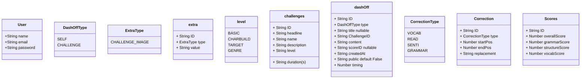

# DashOff Galaxy

### Introduction
Welcome to the Galaxy, Creative Writing Exploration Application!
This project aims to provide a platform for individuals to hone their creative writing skills through various exercises, prompts, and feedback mechanisms. The backend implementation is designed to support the application's core functionalities, ensuring a seamless and engaging user experience.

## Features
- Writing Prompts: Generate diverse writing prompts to inspire creativity.
- Exercise Modules: Structured exercises to improve different aspects of writing.
- Feedback System: Allow users to give and receive constructive feedback on their writings.
- User Profiles: Manage and track user progress and preferences.
- Content Management: Admin interface to add, edit, and delete writing prompts and exercises.
- Statistics and Analysis: Tools to analyze writing patterns and improvement over time.

## Tech Stack
- Backend Framework: Node.js with Express.js
- Database: MongoDB for storing user data, prompts, exercises, and feedback
- Authentication: JWT for secure user authentication
- Version Control: Git for source code management

### Getting Started

#### Prerequisites
Ensure you have the following installed on your machine:

- Node.js (version 14.x or later)
- MongoDB
- Git

#### Installation
Clone the repository:

git clone https://github.com/yourusername/creative-writing-app.git
cd galaxy

#### Install dependencies:


`npm install`

Set up environment variables:

Create a .env file in the root directory and add the following:

```
PORT=3000
MONGO_URI=your_mongodb_connection_string
JWT_SECRET=your_jwt_secret_key
```

#### Run the application:


npm start

#### Access the application:

Open your browser and navigate to http://localhost:3000

#### Contributing
We welcome contributions from the community! To contribute:

Fork the repository
Create a new branch (git checkout -b feature/your-feature-name)
Make your changes and commit them (git commit -m 'Add some feature')
Push to the branch (git push origin feature/your-feature-name)
Open a Pull Request

#### License
This project is licensed under the MIT License. See the LICENSE file for details.

#### Contact
For any questions or inquiries, please contact us at [support@dashoff.com].





API documentation:
/signup
/login


POST /dashoff
- Check if there is current challenge going on
- Check the type of dashoff user needs to create
- If dashoff is challenge:
  check if challenge exist with the ID and user is eligible for the challenge
  Check if already there is dashoff with similar dashoff
    if not allow further
    else raise challenge is already part of the user
- Create dashoff and send ID and serializable data to user

Save dashoff content
- Check dashoff exist with ID and belongs to the user
- Check if is timed, send custom error message
- Update and send content

Get challenges
- Send cards data to UI


Complete challenge
- fetch challenge
- check challenge is active
- Trigger for evaluation // Fake for now
- Mark as completed

Get single dashOff data
- Check dashoff exist show view point
- Send along with score
- Send only content user is not the owner


v2:
Admin:
- Create challenge


Create score
- Create a different router
- Get the score value from body and add to score table


Make public show view endpoint to users
- Share the data to users


Text editing sources:
https://www.cs.unm.edu/~crowley/papers/sds/sds.html
https://www.finseth.com/craft/index.html